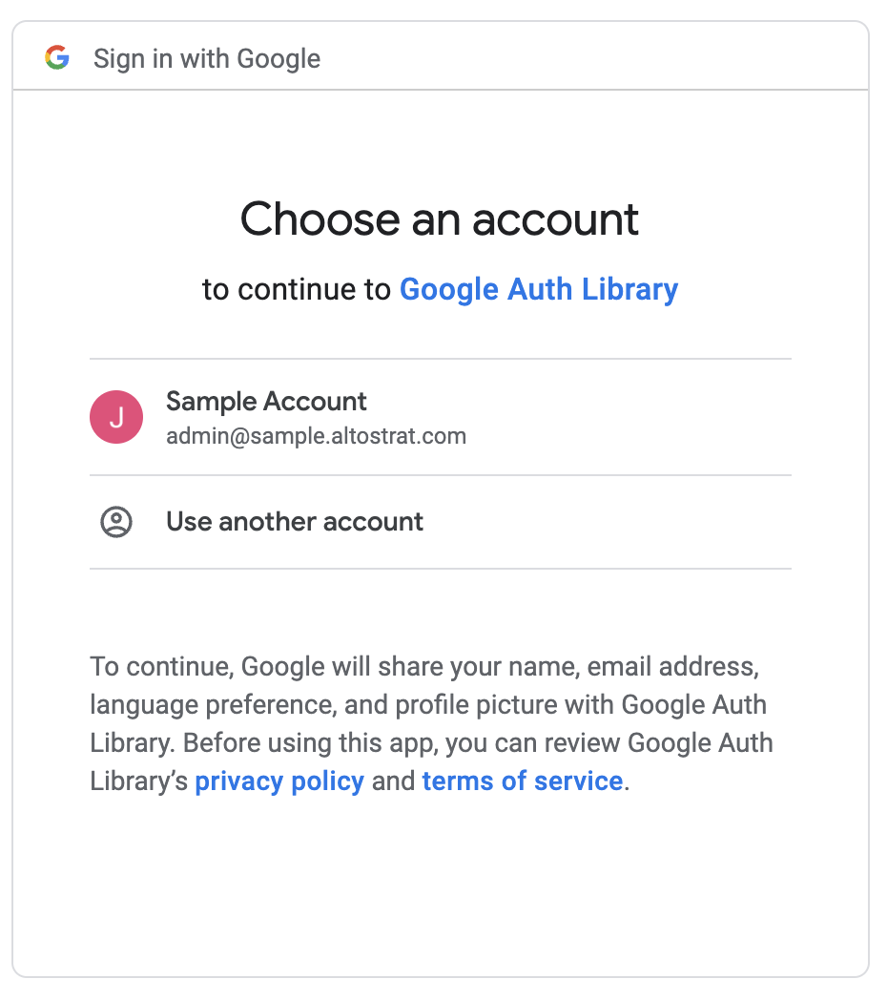
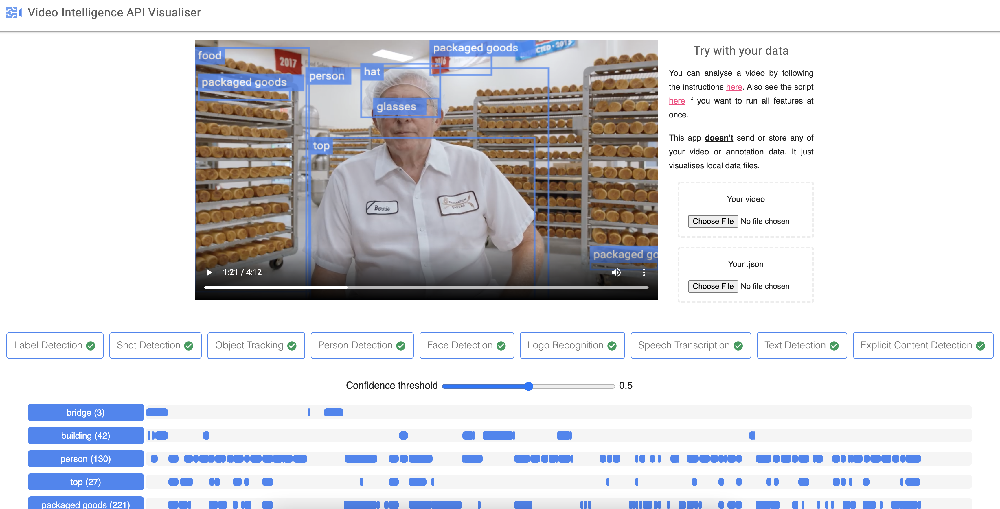

### How to authenticate using Argolis

1. Run the following command:

`gcloud auth application-default login`

2. Select your account



3. Run the following command

`python demo.py`

4. Example output:

```
Processing video "gs://cloud-samples-data/video/JaneGoodall.mp4"...
------------ Video shots: 6 ------------
  1 |   0.000 |  12.880
  2 |  12.920 |  21.680
  3 |  21.720 |  27.880
  4 |  27.920 |  31.800
  5 |  31.840 |  34.720
  6 |  34.760 |  36.960
------------------------------- Video labels: 10 -------------------------------
 96% |   0.000 |  36.960 | nature
 74% |   0.000 |  36.960 | vegetation
 59% |   0.000 |  36.960 | tree (plant)
 56% |   0.000 |  36.960 | forest (geographical feature)
 49% |   0.000 |  36.960 | leaf (plant)
 43% |   0.000 |  36.960 | flora (plant)
 38% |   0.000 |  36.960 | nature reserve (geographical feature)
 38% |   0.000 |  36.960 | woodland (forest)
 35% |   0.000 |  36.960 | water resources (water)
 32% |   0.000 |  36.960 | sunlight (light)
------------------------------- Shot labels: 29 --------------------------------
planet (astronomical object)
 83% |   0.000 |  12.880
earth (planet)
 53% |   0.000 |  12.880
water resources (water)
 43% |   0.000 |  12.880
aerial photography (photography)
 43% |   0.000 |  12.880
vegetation
 32% |   0.000 |  12.880
 92% |  12.920 |  21.680
 ...
 ....
 .....
 ```
---

### Video Intelligence API Visualizer



Link: https://zackakil.github.io/video-intelligence-api-visualiser/

Sample Content:
* [sorter.mp4](./sample_videos/sorter.mp4) / [sorter.json](./sample_videos/sorter.json)
* [traffic.mp4](./sample_videos/traffic.mp4) / [traffic.json](./sample_videos/traffic.json)

---

### Original reference code can be found below
* [CodeLab](https://codelabs.developers.google.com/codelabs/cloud-video-intelligence-python3)
